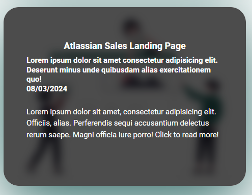
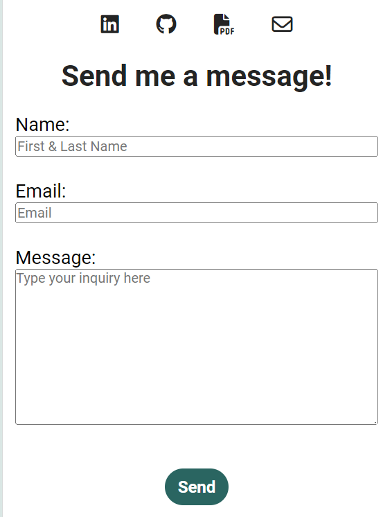
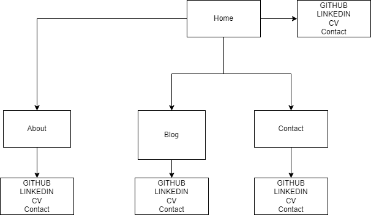

# Khefford.io Portfolio Website

https://khefford.netlify.app/  
https://github.com/KennethHefford/KennethHefford_T1A2

## Purpose

The Purpose of this Portfolio Website is to showcase my best work, what services I offer, and my experience to my target audience being a potential employer or client. This Portfolio Website will further demonstrate my capability to be an asset to a company or client in the case of freelancing services.

## The Technology, Programs and Deployment

This website was created using HTML & CSS through the VS Code Program. Source Code was uploaded to GitHub. Deployment was done through Netlify using GitHub as the source. Wireframe was done using Figma. Sitemap was made using draw.io. Images for blogs were sourced from unsplash.com. 

## Inspirations

The main inspiration for my portfolio website design and structure is from the Sydney University website (www.sydney.edu.au).  
Their design is simplistic, modern and provides ease of access.

The Navigation bar made it very easy to navigate the website as the links were neat, simple bestowing a clean and artful website. Footer is very clean and bold highlighting important links.  Using their website as inspiration I was able to create my own design.

### Navigation Bar

### Body

### Footer

## Website Theme and Design

### Title Domain

I chose to name the website "khefford.io" as most tech start ups are using .io for their domain name; io meaning input/output. As I plan to also freelance, I wanted to make the name itself demonstrate modern technology references.

### Colour Scheme and Font

There were three main colours that I used to brighten the website, engage and guide the audience to the navigation and important links. Green seemed to be a very relaxing colour signifying growth and is pleasing to the eyes.

The colours were also used to provide website accessibility. Colour 1 is used to guide the viewer to the most important links by being quite bold in comparison to the background.

Colour 2 was used to further bolden the important links when hovering.

Colour 3 was used to give you an indication of where you are in regards to which page you are currently viewing for either Home, About, Blog. Image below shows you are on the about page.

The font roboto was used for all the text from google fonts. As it is a very neutral choice and keeps the site very simplistic.

### Personal Brand Logo

The Logo I used was an AI Generated Image rendering of myself. The goal of this website is to convey my professional skillset, character, and experience. Therefore, it is pertinent to create a logo that represented myself as well as incorporate modern technology references like AI, similarly to how I used .io in the domain. The logo itself is a link to the home page to further allow for ease of navigation.

### Layout

The overall website needed to be simple and clean, while still allowing demonstration of skill set through some website features and functionality. The Navigation Bar illustrated a clear logical left to right conformation of Home, About, Blog, and Contact as typical websites.

The layout was carefully structured to incorporate website accessibility, ease of navigation, and clarity of information. The navigation and header section of every page is similar to maintain a consistent theme throughout the website. The footer is consistent as typical of any website. The website needed to be consistent and responsive to further allow for accessibility and ease of use no matter the screen size or device used to view the website. The responsive design was attributed to common devices screen sizes from 480px, 768px, and larger screens such as desktops or laptops.

More layouts in the [khefford.io WireFrame](./docs/kennethhefford_t1a2-wireframe%20desktop%20tablet%20mobile.pdf)

### Responsiveness

The website must look consistent while adhering to screen size of the device used to view the website. Changing the conformation of specific components such as making the Navigation Bar and Tech Stack to vertically orientated for mobile viewports. Additonally, the home button is completely removed and replaced by the website name button which acts as the home button or the logo can simply be used.

A bold project button allowed for ease of navigation to the About page directly to the project section. This was done as the about page gave insight into character for an idea of what might this person be like in terms of contribution to workplace culture and be able to illustrate the projects within the same page.

Contact links were implemented in every page of the website in the form of Icons provided by font awesome. This allowed prospective clients or companies to be able to contact me via socials or the contact form, and view my work or experience through LinkedIn, github, or the resume.

### Body & Content

The image used on the index page gives a bit of insight into the freelancing website builder service that I provide. The image matches the colour scheme of the website. This image was obtained from Undraw.co.

### Technology Stack

The Technology Stack section can either be accessed by a link into the section or by scrolling down. This section is repeated in relevant areas of the site such as index, about, and the contact page as it is a clear indication on the kind of work I am capable of and the particular skills that employers are looking for. However, it is removed from the blog section as it may detract from the content.

A feature of this section is the animation that occurs when hovering over each of the Technologies to showcase some skills in CSS animations. The image of the technology will shrink and dull. In the mobile view port clicking the technologies will play the animation to completion and will only undo once clicked elsewhere on the screen.

### Footer

The footer is consistent throughout the website and has links to all the socials and to navigate back to home page via the logo.

### Blog & Projects

The Blog section was aptly named Tech Talks to highlight Tech Industry Related news and thought provoking articles. The social links remained under the header section as potential readers may like to contact me about a particular blog. The reason this was done was to showcase uncommon CSS skills.

Each individual blog can be accessed and viewed by hovering over the blog button. The image becomes darker, zoomed in, and blurred, allowing white text to appear and illustrate the entire blog. On the mobile website these images act as buttons and the same blog will be responsive to the mobile or tablet viewports.

Desktop

Mobile

Projects were also illustrated with the same method for all viewports.

### Contact Page Form

The contact page contained a simple form that allowed potential clients or employers to contact me via the website. Socials were still able to be accessed on this page via the font awesome links or footer.

## Sitemap of the website

## Challenges

Originally I uploaded only the src folder into the repository which does not contain the readme.md file. In order to rememdy this I had to create a new repository to upload the required files.

Another issue faced was the blog and the project buttons on mobile and tablet viewports. When using a different browser like safari, the buttons did not function correctly and must be held in order to view the text within the buttons.

# End
